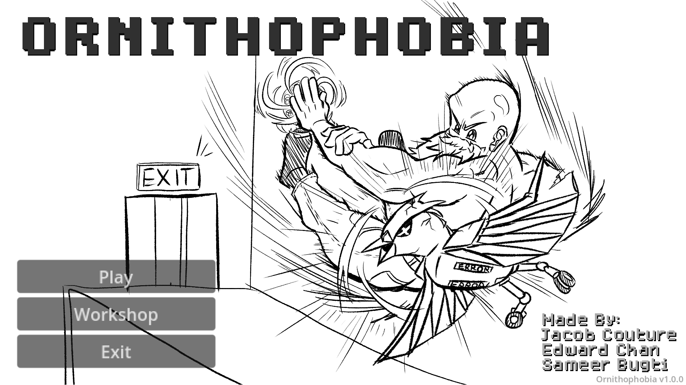

# README File

## Project Ornithophobia

## 0. Copyright & Credits

### a. Team Members

* Jacob Couture  
  * jacob.couture859@gmail.com
* Chun Ho Chan, Edward  
  * edwardchanchunho@gmail.com  
* Sameer Mehboob Bugti  
  * sbugti04@gmail.com  

### b. Team Name

Team Ornithophobia  

### c. Course Term

Fall 2024  

### d. Course Info

This game project was created as part of CompSci 3307A at Western University.  

### e. 3rd Party Resources

* Background Music (CC BY license)  
  * "東方 Piano - Green-Eyed Jealousy 『2』", made by -K.  
    * https://youtu.be/DizE73Ie3Ok  
* All sprites, background images, and sound effects are custom-made.  

## 1. Short Description

This is a game project (combined individual assignments) of CompSci 3307A at Western University.  

It has two major systems: Gameplay, and Level Editor.  

To win the game, use knockback (left-click, right-click) to gain speed, and slam the player into the enemies (at great speed) until all of them explode!  

To edit a level, read the level editor's manual popup because there are too many features!  

The compiled game is available on GitHub's releases.  

## 2. Required Libraries & 3rd Party Tools

* Godot  
  * version 4.3  
  * Note: Use the standard version of Godot instead of the .NET version.  
* GDExtension C++ (godot-cpp)  
  * version 4.3  
  * Note: Use the same version as Godot.  
* C++ Compiler (MinGW)  
  * version 13.2.0+  
  * Note: This compiler must be the same as the one that compiled Godot from source (MinGW for official releases).  
  * Note: If you self-compiled Godot from source using MSVC, then you must also use MSVC to compile this project.  
* Python  
  * version 3.12.4+  
  * Note: This is required for using SCons.  
* SCons  
  * version 4.8.1+ (PyPI)  
  * Note: This is GDExtension's suggested build tool.  
* Doxygen (optional)  
  * version 1.12.0  
  * Note: This is used to generate the HTML doc files.  
* Godot Unit Test (GUT) (optional)  
  * version 9.3.0  
  * Note: This is used to run unit tests for Godot and GDExtension classes.  

## 3. How To Compile (step-by-step guide)

(one-time setup) Setting Up SCons:  
1. Open a terminal in the "{root}/*godot-cpp*/" directory, and then:  
  * Run the command "scons platform=<platform> custom_api_file=<PATH_TO_FILE> <bits=64>".  
  * Example: scons platform=windows custom_api_file="./gdextension/extension_api.json" bits=64  
  * (Full Documentation: https://docs.godotengine.org/en/stable/tutorials/scripting/gdextension/gdextension_cpp_example.html)  
2. Wait about 5 minutes for it to finish.  
3. Check the "{root}/*SConstruct*" file to see if the build path is correct (in each *env.SharedLibrary(...)* function's parameter).  

Steps:  
1. Open a terminal in the ".../*{root}*/" directory, and then either:  
  * Run the command "scons platform=windows target=template_debug debug_symbols=yes" to compile debug builds (support hot-reload), OR,  
  * Run the command "scons platform=windows target=template_release" to compile release builds (more optimized).  
  * (Note: Alternatively, you may run the included shell script "recompile_windows_x64_release.sh" for convenience.)  
2. Open the project in Godot.  
3. Click "Project > Export" in Godot.  
  * (Note: You may need to download & install an export template first.)  

Note:  
* The included build is compiled for 64-bit Windows, Godot's Release Mode.  
* When renaming the directory "{root}/*game*/", be sure to also update its path stored in the file ".../*SConstruct*", and also re-import the project in Godot.  

## 4. How To Run (step-by-step guide)

Steps:  
1. Go to the "{root}/*export*/" directory.  
2. Depending on your operating system, go to one of the subdirectories: "*windows*", "*macos*", or "*linux*".  
3. Double click on the "*FinalGame_Release.exe*" executable to run it.  

Alternatively:  
1. Compile the game from source (refer to Section 3).  
2. Import the "{root}/*game*/" directory into Godot, and then exit Godot.  
3. Reopen Godot, highlight the project "*UntitledShotgunProject*", and click "Run".  
  * (Note: If Godot fails to run, check the Godot executable path stored in the file "{root}/game/.godot/editor/*project_metadata.cfg*".)  

## 5. Notes For TA

Invividual Contributions:  

Jacob Couture:  
* Player physics  
* Enemy physics  
* UI screens (except level editor screen)  
* Story levels 4-6  

Chun Ho Chan, Edward:  
* Level editor  
* Level file loading/ saving  
* Screen transition  
* Story levels 1-3  

Sameer Mehboob Bugti:  
* Player animation  
* Enemy animation  
* Background  
* Visual effects  

Game Lore:  
"In the year 1984, a tech company called "SKYNEST" started selling drones to governments across the globe. 
Formally known as "Bipedal Intelligent Reconnaissance Devices", these drones actively monitor each citizen to deter terrorism, and to protect those in power. 
One day, SKYNEST's system determined that the existence of lower-class citizens is too much risk for a protest, and indiscriminately pecked on the poor. 
You, as a professionally broke window cleaner, fights for your life with your watery arsenal." 
-Chun Ho Chan, Edward  

**Thank you for playing our game!**  

## 6. Miscellaneous

### List of other README files:  

* "{root}/README.md"  
* "{root}/src/README.md"  
* "{root}/game/bin/README.md"  

### Godot Project Settings: 

* Renderer: "Compatibility" mode  
  * Supports desktop, mobile + web platforms.  
  * Least advanced 3D graphics (currently WIP).  
  * Intended for low-end/ older devices.  
  * Uses OpenGL 3 backend (OpenGL 3.3/ ES 3.0/ WebGL2).  
  * Fastest rendering for simple scenes.  
  * (Note: The renderer can be changed later, but scenes may need to be adjusted.)  
* Version Control Metadata: Git  

### How To Generate Godot Docs (empty XML templates):  

Steps:  
1. Open a terminal in the "{root}/game/" directory, and then:  
  * Run the command "<path_to_godot> --doctool ../ --gdextension-docs"  
  * Example: "C:/Program Files/Godot/Godot_v4.3-stable/Godot_v4.3-stable_win64.exe" --doctool ../ --gdextension-docs  
  * (Note: For PowerShell users, add an & character at the front if your path to godot is surrounded by "".)  
  * (Full Documentation: https://docs.godotengine.org/en/stable/tutorials/scripting/gdextension/gdextension_docs_system.html)  
2. Press Enter when the message "Deleting docs cache..." appears.  
  * (Note: This does not delete/ overwrite any existing doc files.)  
3. Manually edit the new .XML doc files are located in the "{root}/doc_classes/" directory.  
4. Recompile the game as a debug build (see Section 3). This links the doc files to the Godot.  

### How To Generate C++ Docs with Doxygen (HTML):  

Steps:  
1. Document the code files in Doxygen syntax (i.e. put file description at the top)  
2. Open a terminal in the "{root}/" directory, and then:  
  * Run the command "doxygen"  

### How To Fix Undetected C++ Header Files in VSCode:  

Steps:  
1. Open VSCode and open the Extension Settings page of "C/C++".  
2. Search for the "Include Path" setting, and then add item:  
        ${workspaceFolder}/**  
3. At the top navigation bar, click "File > Add Folder to Workplace".  
4. Select the "{root}/" directory.  
5. At the top navigation bar, click "File > Save Workplace As".  
6. Save the workplace file outside the "{root}/" directory.  
7. Restart VSCode and reopen the workplace file.  
